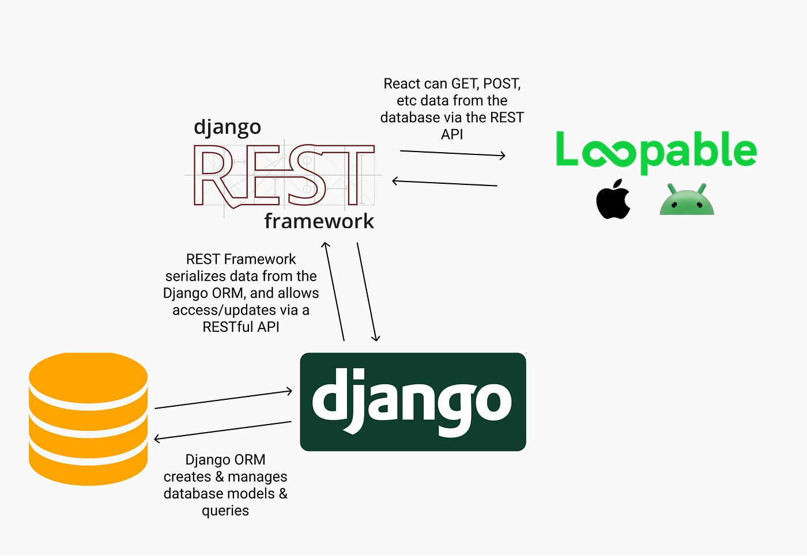

<!--suppress HtmlDeprecatedAttribute -->
<p align="center">
  
</p>

# The product
LOOPABLE is a platform that promotes the circular economy and environmental sustainability with the rental of objects between private individuals. Users reduce the environmental impact of the production of goods intended for little use, earning through the rental of the objects they own. It allows responsible management of resources and the reduction of waste, contributing to a more sustainable future.

## Backend
This is a Django Rest Framework project for https://loopable.it.

Let's try to use [conventional commits](https://cheatography.com/albelop/cheat-sheets/conventional-commits/).



## Run the project
To run the project, you need to have at least **Python 3.9** installed on your PC. 
Then, you can install all the dependencies in a new virtual environment with the following command:
```bash
python3 -m venv env  # Create a new virtual environment
source env/bin/activate  # Enter the virtual env on Linux/MacOS
env\Scripts\activate  # Enter the virtual env on Windows
pip install -r requirements.txt  # Install the dependencies
```

Ask someone to give you the `.env` file with the environment variables.

To run the project **make sure to have all the environment variables set in the `.env` file**. 
Then, you can run the project with the following command **inside the virtual environment**:
```bash
python src/manage.py runserver 8000
```

This will start a Django development server on port 8000.

If inside the `.env` file the variable `DJANGO_ENV` is set to `LOCAL`, the project will use a local database file.
This will create a local database file that you can find in `src/db_local.sqlite3`.

You can test if it works by opening the following URL in your browser: http://localhost:8000/stats/ht/.

If the database is unavailable, or you get the `OperationalError: no such table` error you 
need to run the migration to create tables in the **local** database used for development.
Stop the server and run the following command, then start the server again:
```bash
python src/manage.py migrate  # This will apply migrations to the database
```

Doing this will create tables in the local database.

## Docker

Dockerfile is available, so you can build the image and run the container with the following commands:
```bash
docker build -t loopable-backend .
docker run -p 8000:8000 --name loopable loopable-backend
```

Tip: if windows asks you for firewall permissions, allow it.

### Use the API
APIs authentication is performed using [JWT tokens](https://en.wikipedia.org/wiki/JSON_Web_Token).

We use Google Firebase to authenticate users. 
Every user has a unique `uid` that is used to identify them.

Firebase provides a REST API to authenticate users and get a JWT token.

To get a JWT token and test the APIs you can run this script:
```bash
python src/get_jwt_token.py
```

Edit the `.env` file to log as a different user by changing the `FIREBASE_LOGIN_EMAIL` and `FIREBASE_LOGIN_PWD` variables.

If the authentication is successful the `idToken` will be printed to the console.

You can use this token to authenticate your requests to the API filling the `Authorization` header with the value of the idToken.

You can use Postman to test the APIs or you can use `curl` from the command line:
```bash
curl --location --request GET 'http://localhost:8000/api/v1/product-categories/' \
        --header 'Authorization: eyJhbGZ......'
```

Take a look to the swagger here: http://localhost:8000/api/v1/swagger/.
In alternative, you can use the redoc here: http://localhost:8000/api/v1/redoc/.

## Pylint
Pylint is a Python static code analysis tool that helps developers find and fix errors, 
enforce coding style, and enhance code quality. It checks for issues, adheres to PEP 8 style 
guidelines, and allows customization. Pylint is essential for maintaining clean, 
error-free Python code.

Run this command to check the code:
```bash
pylint --rcfile=pylintrc ./src
```

## Code style
Flake8 is a Python tool that performs code analysis by combining multiple tools
to check code quality, enforce coding standards, and identify errors, simplifying the process of code review 
and enhancement.

Run this command to check the code style:
```bash
flake8 src/ --config=flake8 --show-source --statistics
```

## Run the tests
To run the tests, **make sure to have all the environment variables set in the `.env` file** and then 
run the following command **inside the virtual environment**:
```bash
python src/manage.py test -v 2
```

## Migration
To run the migration, **make sure to have all the environment variables set in the `.env` file** and then 
run the following command **inside the virtual environment**:
```bash
python src/manage.py showmigrations  # Show the migrations status
python src/manage.py makemigrations  # Create the migration files
python src/manage.py migrate  # Run the migration (edit database schema)
```

Remember to run the migration every time you change the models. After that commit also the migration files.
